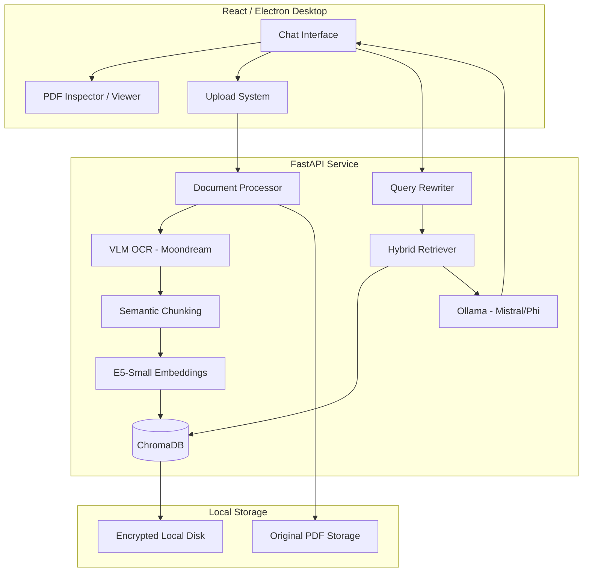

# 🚀 Omni-Doc AI
### *The Ultimate Offline Document Intelligence Engine*

[](https://fastapi.tiangolo.com/)
[](https://reactjs.org/)
[](https://ollama.com/)
[](https://www.trychroma.com/)

An enterprise-grade, **fully offline** AI system designed to understand, search, and answer complex questions from your documents using a high-precision Retrieval-Augmented Generation (RAG) pipeline.

---

## 🏗️ System Architecture

Omni-Doc uses a multi-layered architecture designed for speed, privacy, and accuracy.



---

## ✨ Standout Features

### 🔍 Integrated Document Inspector
Unlike generic chat apps, Omni-Doc provides a **synchronized dual-pane view**. When the AI cites a source, you can click the citation to open the exact PDF page in the integrated inspector, complete with page-specific navigation.

### 🧠 VLM-Powered OCR (Vision Language Model)
We don't just use standard OCR. Omni-Doc implements a **3-strip horizontal slicing strategy** using `moondream` via Ollama. This allows the system to process dense, handwritten notes and complex layouts that traditional OCR often misses.

### 🔐 Secure Session Isolation
Every chat session is a private workspace. Documents uploaded to "Session A" are never visible or retrievable in "Session B," ensuring perfect multi-tenant privacy on your local machine.

### ⚡ Hybrid Search Performance
- **Semantic Search**: Vector embeddings for conceptual understanding.
- **BM25 Keyword Search**: High-precision term matching.
- **Query Rewriting**: The AI refines your questions to improve search results.

---

## 🛠️ Tech Stack

- **Frontend**: React 18, Tailwind CSS, Framer Motion, Lucide Icons.
- **Desktop Engine**: Vite + Electron (for native offline experience).
- **Backend API**: FastAPI (Python 3.11+).
- **RAG Orchestration**: LangChain & ChromaDB.
- **AI Models**: 
  - **LLM**: `Mistral` / `Phi-3` (via Ollama).
  - **VLM**: `Moondream2` (for high-accuracy OCR).
  - **Embeddings**: `intfloat/e5-small-v2` (Local).

---

## ⚙️ Installation & Setup (Windows)

### 1️⃣ Prepare AI Models (Ollama)
Download and install [Ollama](https://ollama.com). Then, pull the required models:
```powershell
ollama pull phi
ollama pull moondream
```

### 2️⃣ Backend Configuration
```bash
cd backend
python -m venv venv
venv\Scripts\activate
pip install -r requirements.txt
# Copy .env.example to .env and configure local paths
python main.py
```

### 3️⃣ Frontend Development
```bash
cd frontend
npm install
npm run dev
```

---

## 📈 Data Flow Lifecycle

1. **Ingestion**: File is sliced into strips -> VLM extracts text -> Recursive chunking.
2. **Indexing**: Chunks are embedded into 384-dimensional vectors -> Saved to ChromaDB with metadata (Page #, Source ID).
3. **Retrieval**: User query is rewritten -> Hybrid search finds top 5 relevant chunks -> Context is pruned.
4. **Generation**: LLM generates answer with `[N]` citations based *only* on retrieved context.

---

## 📊 Roadmap
- [x] Streaming LLM Responses
- [x] Integrated PDF Page Viewer
- [x] VLM-based OCR Fallback
- [ ] Multi-Modal Image Chat
- [ ] Exportable Research Reports
- [ ] Dark Mode UI Theme

---

## 📄 License
Distributed under the MIT License. See `LICENSE` for more information.

**Built with ❤️ for Privacy and Intelligence.**
